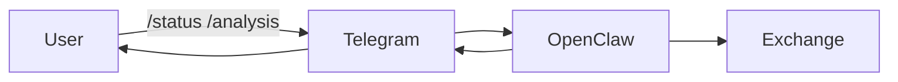
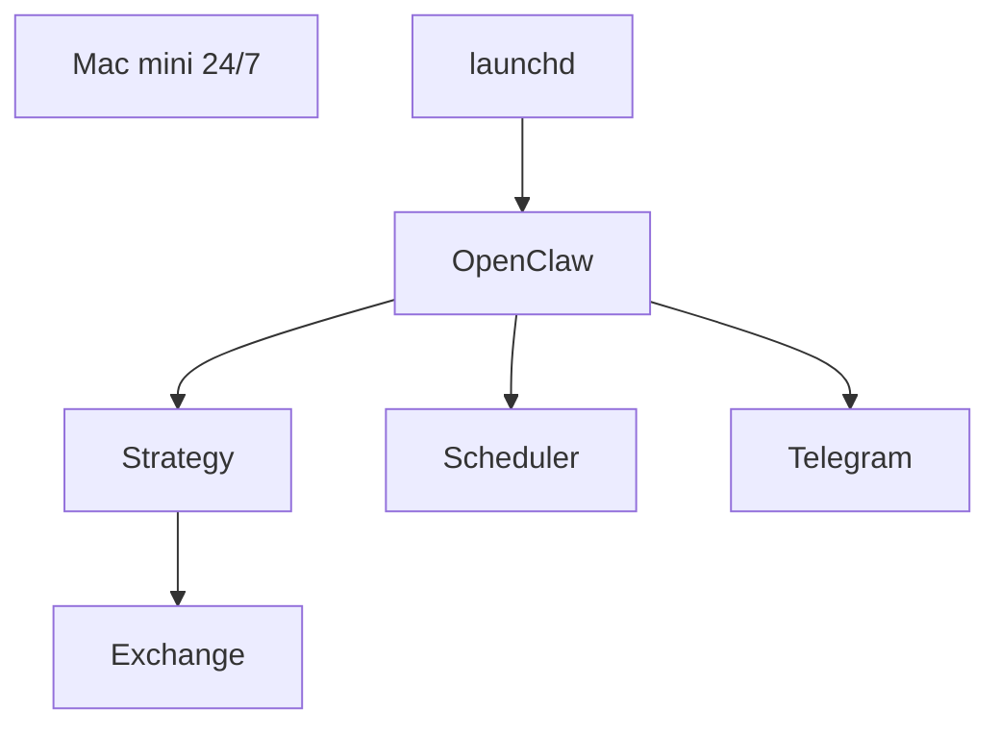

# Quant Trading Execution System

정량 전략(Sennot Model) 기반 자동 매매 실행 및 리스크 통제 인프라 시스템입니다.  
몰트봇(MoltBot) API를 활용한 주문 실행과 데이터베이스 기반 거래 이력 관리 구조를 포함합니다.

본 프로젝트는 단순 자동매매 봇이 아닌,  
전략 판단 → 리스크 통제 → 주문 실행 → 로그 기록 → 모니터링까지  
하나의 실행 파이프라인으로 설계된 정량 트레이딩 시스템입니다.매수매도 기준과 페르소나는 사용자 요구사항에 따라 확장 가능합니다. 

---

# 🧠 시스템 구조 및 흐름

## 1️⃣ 사용자 관점

본 시스템은 사용자가 직접 매매를 수행하는 구조가 아닌,  
전략 기반 자동 실행 시스템을 **Telegram 인터페이스를 통해 통제·모니터링하는 형태**로 설계되었습니다.

1️⃣ Telegram에서 `/start` 명령으로 자동매매 활성화  
2️⃣ OpenClaw 가 장중 또는 주기 실행에 따라 전략애 따라 자동 판단 [매수/매도/보류]  
3️⃣ 체결 발생 시 실시간 알림 수신  
4️⃣ `/positions` 명령으로 현재 포지션 확인  
5️⃣ `/status`로 리스크 상태 및 운용 현황 점검  
6️⃣ 일일 리포트를 통해 성과 요약 확인  

사용자는 개별 종목을 수동 매매하지 않고,  
시스템의 전략 및 리스크 가드 구조를 신뢰하고 감독하는 역할을 수행합니다.
---

## 2️⃣ 시스템 구조 관점

시스템은 다음 6단계로 구성됩니다:

1️⃣ Market Data Collection  
2️⃣ Universe Filtering  
3️⃣ Sennot Strategy Engine (Signal Generation)  
4️⃣ Risk Guard & Position Sizing  
5️⃣ Order Execution (MoltBot Adapter)  
6️⃣ Database Logging & Telegram Reporting  

* **Mac mini** : 항상 켜져 있는 로컬 서버
* **launchd** : 봇이 죽으면 자동 재시작
* **OpenClaw** : 전략 실행 엔진
* **Scheduler** : 정해진 시간마다 실행
* **Telegram** : 원격 제어 인터페이스

---

## 🎯 설계 목적

* 24/7 자동매매
* 재부팅 후 자동 복구
* 모바일 원격 제어
* 모델 교체 가능 구조

---

## 📲 Telegram Interface as Control Layer

Telegram은 단순 알림 도구가 아니라  
**운영 통제(Control Plane) 역할**을 합니다.

### 주요 기능:

- 실시간 체결 알림
- 리스크 트리거 발생 시 경고 메시지
- 시스템 활성/비활성 전환
- 현재 보유 포지션 조회
- 전략 실행 상태 점검
- 일일 리포트 자동 전송

이를 통해 사용자는 별도의 UI 없이도  
모바일 환경에서 시스템 상태를 통제할 수 있습니다.

---

## 🔍 Operational Philosophy

본 시스템은 다음과 같은 사용자 철학을 기반으로 설계되었습니다: 

- 감정 배제 (Emotionless Execution)
- 전략 기반 자동 의사결정
- 리스크 우선 통제 구조
- 상태 기반 운영 감독

사용자는 "트레이더"라기보다  
"전략 운영자(Strategy Supervisor)"의 역할을 수행합니다.
--- 

# 🧠 Sennot Strategy Engine

Sennot 모델은 본 시스템의 핵심 전략 엔진입니다.  
추세 필터와 돌파/조정 전략을 결합한 하이브리드 구조입니다.

### 📈 Trend Filter
- Close > SMA240 (장기 추세 상향 종목만 거래)

### 📊 Entry Logic
- 5/20 이동평균 골든크로스 + 거래량 1.5배 증가
- 20일 고점 돌파 + 거래량 증가
- -2% ~ -4% Pullback 후 반등

### 📉 Exit Logic
- -4% Stop Loss
- +7% 부분 익절 후 -3% Trailing Stop
- 10일 시간 기반 청산

Sennot 모델은 **상태 기반 의사결정 구조**로 설계되어  
보유 여부, 추세 상태, 리스크 상태에 따라 BUY / SELL / HOLD를 결정합니다.

---

# 🛡 Risk Management Layer

전략보다 우선 적용되는 리스크 통제 레이어입니다.

- 최대 보유 종목 수: 8개
- 섹터 비중 상한: 40%
- 일일 손실 -3% 초과 시 신규 매수 차단
- MDD -10% 초과 시 포지션 규모 50% 축소
- 최소 주문 단위 및 현금 검증

리스크 가드는 Sennot 모델의 신호를 그대로 실행하지 않고,  
실행 가능 여부를 재검증하는 구조로 설계되었습니다.

---

# 🔄 Order Execution Architecture

## 📌 MoltBot Adapter

몰트봇은 주문 실행 계층을 담당합니다.

역할:
- 주문 생성 (place)
- 주문 취소 (cancel)
- 주문 수정 (replace)
- 체결 상태 조회

전략 엔진과 브로커 API를 분리하기 위해  
Adapter 패턴으로 설계되었습니다.

이 구조를 통해:
- Paper / Live 모드 전환 가능
- 실행 계층 독립 테스트 가능
- 브로커 교체 확장성 확보

---

# 🗄 Database Layer

SQLite 기반 거래 기록 시스템

저장 항목:
- signals
- orders
- fills
- positions
- daily_metrics
- events / errors

목적:
- 전략 재현 가능성 확보
- 체결 이력 추적
- 성과 분석
- 감사 로그 기록

---

# 🤖 Telegram Control Interface

Telegram은 단순 알림 도구가 아닌  
**시스템 운영 인터페이스** 역할을 합니다.

지원 명령어:

- /start → 자동매매 활성화
- /stop → 신규 매수 차단
- /status → 현재 상태 조회
- /positions → 보유 포지션 확인
- /analysis → 전략 요약 분석

기능:
- 실시간 체결 알림
- 리스크 트리거 발생 알림
- 일일 리포트 전송
- 시스템 heartbeat 모니터링

Telegram을 통해 외부에서  
시스템 상태를 통제 및 점검할 수 있습니다.

---

# 🔁 Scheduler & Runtime

- Kiwoom: 장중 스케줄 기반 실행
- Bybit: 24시간 주기 실행
- PM2 기반 프로세스 관리
  - 자동 재시작
  - 장애 복구
  - heartbeat 체크

---

# 🏗 Architecture Flow

상세 구조는 [ARCHITECTURE.md](ARCHITECTURE.md) 참고.

Pipeline:

Market Data  
→ Universe Filter  
→ Sennot Engine  
→ Risk Guard  
→ Position Sizing  
→ MoltBot Execution  
→ DB Logging  
→ Telegram Reporting  

---

# 🧰 Tech Stack

- Python
- MoltBot API
- Kiwoom API
- Bybit API
- SQLite
- Telegram Bot API
- PM2

---

# 🎯 Design Principles

- 전략과 실행의 분리
- 리스크 통제 우선 구조
- 상태 기반 의사결정
- Adapter 패턴 기반 브로커 추상화
- 로그 기반 추적 가능성
- 장애 대응 자동화

---

## ⚠ Disclaimer

본 프로젝트는 실제 투자에 사용하기 위해서 설계되었습니다.
실제 투자 판단은 개인의 책임하에 이루어져야합니다. 

