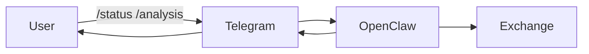
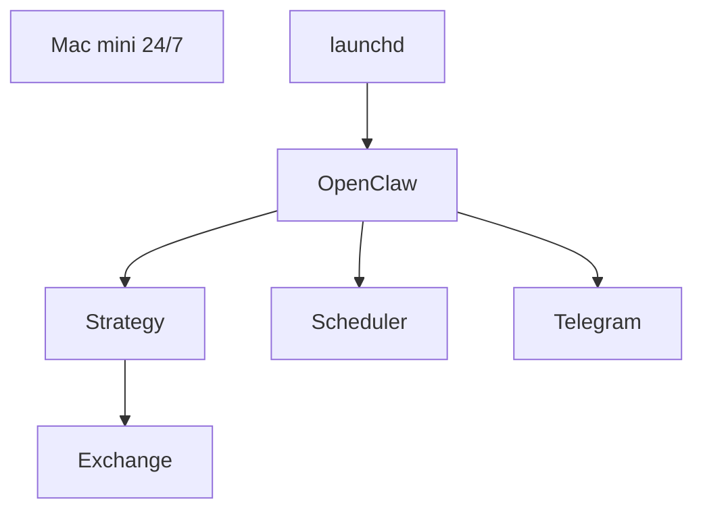
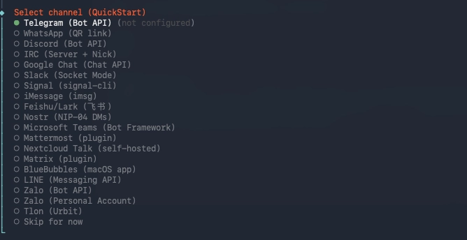
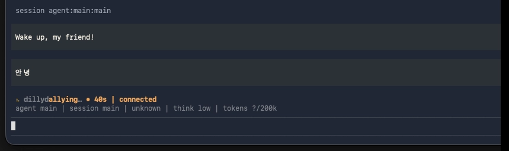
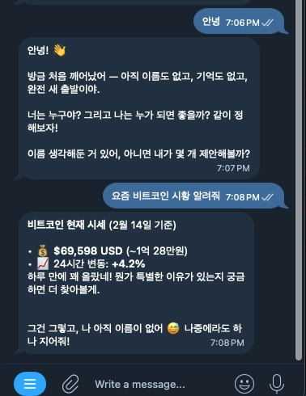
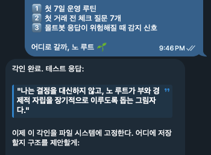
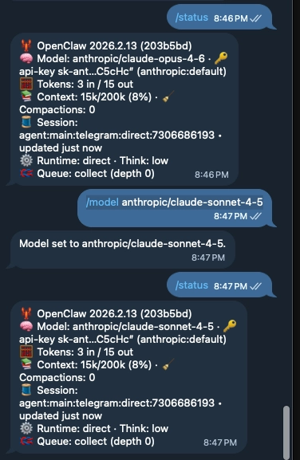

# 🚀 Mac mini 초기 세팅부터 OpenClaw 24/7 자동매매 운영까지


---

# 🧠 시스템 구조 및 흐름

## 1️⃣ 사용자 관점

> Mac mini는 서버,
> Telegram은 원격 콘솔이다.

사용자는 텔레그램에서 명령어만 입력하면 된다.



* Telegram이 인터페이스 역할
* OpenClaw가 전략 실행
* 거래소 API로 주문 실행
* 결과는 다시 Telegram으로 반환

---

## 2️⃣ 시스템 구조 관점



### 구조 설명

* **Mac mini** : 항상 켜져 있는 로컬 서버
* **launchd** : 봇이 죽으면 자동 재시작
* **OpenClaw** : 전략 실행 엔진
* **Scheduler** : 정해진 시간마다 실행
* **Telegram** : 원격 제어 인터페이스

---

## 🎯 설계 목적

* 24/7 자동매매
* 재부팅 후 자동 복구
* 모바일 원격 제어
* 모델 교체 가능 구조
---

> macOS 초기화 상태 → 개발환경 세팅 → OpenClaw 설치 → Telegram 연동 → 24/7 launchd 운영 → 모델 Sonnet 변경 → 상태 확인 완료


# 1️⃣ macOS 초기 상태 세팅

## 1.1 Xcode Command Line Tools 설치

```bash
xcode-select --install
```

설치 확인:

```bash
xcode-select -p
```

---

# 2️⃣ Homebrew 설치

```bash
/bin/bash -c "$(curl -fsSL https://raw.githubusercontent.com/Homebrew/install/HEAD/install.sh)"
```

설치 후 PATH 추가 (Apple Silicon 기준)

```bash
echo 'eval "$(/opt/homebrew/bin/brew shellenv)"' >> ~/.zprofile
eval "$(/opt/homebrew/bin/brew shellenv)"
```

설치 확인:

```bash
brew --version
```

---

# 3️⃣ Node.js & npm 설치

```bash
brew install node
```

확인:

```bash
node -v
npm -v
```

---

# 4️⃣ OpenClaw 설치

```bash
npm install -g openclaw
```

설치 확인:

```bash
openclaw --version
```

---

# 5️⃣ API 토큰 환경변수 등록

## 5.1 zsh 기준

```bash
nano ~/.zshrc
```

추가:

```bash
export ANTHROPIC_API_KEY="여기에_토큰"
```

적용:

```bash
source ~/.zshrc
```

확인:

```bash
echo $ANTHROPIC_API_KEY
```

---

# 6️⃣ OpenClaw 초기 실행

```bash
openclaw
```

---

# 7️⃣ channel 및 Skill 선택 (TUI 진입 과정)

OpenClaw 실행 시 TUI (Terminal UI) 화면 진입

* channel 은 텔레그램만 선택


* skill 은 다 선택하지 말 것 
* hatch your bot > 맥미니 서버를 이용하고 launchd 로 24시간 실행, 자동매매가 목적이므로 TUI 선택


---

# 8️⃣ Telegram 연결

## 8.1 텔레그램 봇 생성 (OpenClaw 온보딩)

1. Telegram에서 `@BotFather` 검색
2. `/newbot`
3. 봇 이름 입력 (_bot 으로 끝나야 함)
4. 토큰 발급

---

## 8.2 OpenClaw에 봇 토큰 입력

```bash
mkdir -p ~/openclaw/config
nano ~/openclaw/config/env.sh
export ANTHROPIC_API_KEY="클로드_API키"
export TELEGRAM_BOT_TOKEN="텔레그램_봇토큰"

source ~/openclaw/config/env.sh # 환경변수 적용 
chmod 600 ~/openclaw/config/env.sh  # 보안권한 
cat ~/openclaw/config/env.sh


~/openclaw/config/env.sh
export TELEGRAM_BOT_TOKEN="여기에_토큰"
```

---

## 8.3 Telegram 페어링 코드 입력

OpenClaw 실행 후 표시되는 Pair Code를 Telegram에 입력

```
/pair XXXXX
```

연결 성공 시:

```
Bot successfully paired
```

---

# 9️⃣ Telegram 마인드셋 주입

> 텔레그램은 단순 알림용이 아니라 운영 콘솔이다. 
> 자신이 원하는 봇 마인드셋 입력 


주요 명령어:

```
/start
/status
/stop
/positions
/analysis
```




---


# 🔟 24/7 자동 운영 준비

## 10.1 launchd 등록 (macOS 서비스 등록)

LaunchAgent 파일 생성:

```bash
nano ~/Library/LaunchAgents/com.openclaw.bot.plist
```

예시 구조:

```xml
<?xml version="1.0" encoding="UTF-8"?>
<plist version="1.0">
<dict>
    <key>Label</key>
    <string>com.openclaw.bot</string>

    <key>ProgramArguments</key>
    <array>
        <string>/opt/homebrew/bin/openclaw</string>
    </array>

    <key>RunAtLoad</key>
    <true/>

    <key>KeepAlive</key>
    <true/>
</dict>
</plist>
```

등록 및 확인 :

```bash
launchctl print gui/$(id -u)/ai.openclaw.gateway | head -n 40
plutil -p ~/Library/LaunchAgents/ai.openclaw.gateway.plist | egrep 'RunAtLoad|KeepAlive|StandardOutPath|StandardErrorPath'

```

### 1. RunAtLoad = true

→ 로그인/재부팅 시 자동 실행됨

(맥 껐다 켜도 자동으로 살아남)

### 2.  KeepAlive = true

→ 프로세스 죽으면 launchd가 자동 재시작함

(에러 나도 다시 켜짐)

### 3. StandardOutPath / StandardErrorPath 있음

→ 로그 파일로 계속 기록됨

(문제 생겨도 추적 가능)


---

# 1️⃣1️⃣ 모델 Sonnet으로 변경

## 📊 모델 비교표

| 모델            | 장점             | 단점               | 자동매매 적합도 |
| ------------- | -------------- | ---------------- | -------- |
| Claude Opus   | 추론력 매우 뛰어남     | sonnet 의 2배           | ⭐⭐⭐      |
| Claude Sonnet | 속도 빠름 / 가격 합리적 | Opus보다 약간 낮은 추론력 | ⭐⭐⭐⭐⭐    |
| GPT-4         | 범용성 높음         | 금융 특화는 약함        | ⭐⭐       |

</br>
 자동매매 실시간 의사결정에는 Sonnet이 가장 효율적

설정 파일에서 모델 변경: 기본값이 Opus 로 되어있으므로 주의할 것
</br> cli와 텔레그램에서 모델 확인. 둘 다 default 값이 sonnet 으로 되어있어야 위험도 없음. </br> default 값이 opus 에서 바뀌지 않는경우 model json 파일을 확인하여 순서 변경 및 삭제하거나, </br> gateway 삭제 후 다시 생성하는 것을 추천함.

```bash

# 모델 추가 
openclaw configure
# 모델 등록 
openclaw setup > model: claude-3-5-sonnet

openclaw models list > 있는지 확인 
# 상단 모델 변경 
openclaw status 

# 텔레그램에서 확인 
/model anthropic/claude-sonnet-4-5
/status
```


---


---

# 1️⃣2️⃣ 최종 상태 확인

텔레그램에서:

```
/status
```

정상 출력 예시:

```
Bot: RUNNING
Model: Sonnet
Broker: Bybit
Scheduler: Active
LaunchAgent: Loaded
```

---

# ✅ LaunchAgent 설정 완료 확인

```bash
launchctl list | grep openclaw
```

프로세스 살아있으면 성공.

---

# 🎯 최종 구조

```
Mac mini (24/7)
   │
   ├── launchd
   │      └── OpenClaw
   │            ├── Strategy Engine
   │            ├── Scheduler
   │            ├── Broker API
   │            └── Telegram Interface
```

---

# 🧠 운영 철학

* Mac mini는 서버다.
* Telegram은 운영 콘솔이다.
* OpenClaw는 전략 엔진이다.
* launchd는 심장이다.

---


